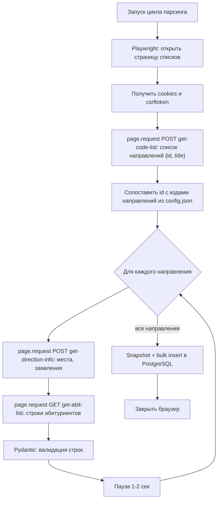
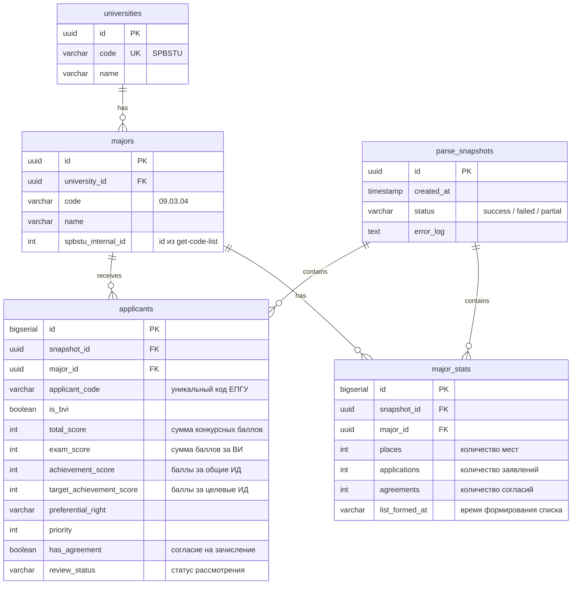

# Спецификация дизайна — Бэкенд парсера конкурсных списков

## 1. Технологический стек

- **FastAPI** — веб-фреймворк (API управления парсером).
- **Playwright (async)** — получение браузерной сессии и CSRF-токена СПбПУ.
- **SQLAlchemy 2.0 (async) + asyncpg** — работа с PostgreSQL.
- **Alembic** — миграции БД.
- **APScheduler** — периодический запуск парсинга.
- **Pydantic v2** — валидация конфига и спарсенных данных.

## 2. Результаты разведки API СПбПУ (проверено запросами)

Страница — не SPA, а классический Django-шаблон с jQuery/select2.
Данные подгружаются тремя AJAX-эндпоинтами:

| Эндпоинт | Метод | Защита | Назначение |
|---|---|---|---|
| `/home/get-abit-list?filter_1=&filter_2=&filter_3=&education_level=bachelor` | GET | только Referer | строки таблицы (JSON) |
| `/home/get-code-list` | POST | CSRF cookie + `X-CSRFToken` | список направлений `{id, title}` |
| `/home/get-direction-info` | POST | CSRF cookie + `X-CSRFToken` | сводка: места, заявления, согласия, время |

Параметры фильтров:
- `filter_1` — форма обучения: 1 Заочная, **2 Очная**, 3 Очно-заочная.
- `filter_2` — условия: **1 Бюджетная основа**, 2 Контракт, 3 Особое право, 4 Отдельная квота, 6 Целевой прием.
- `filter_3` — внутренний id направления (берётся из `get-code-list`, не совпадает с кодом «09.03.04»).

Важные факты:
- GET `get-abit-list` работает без cookie, но **без заголовка `Referer` WAF возвращает «upstream»**.
- csrftoken cookie выдаётся только браузерному контексту (через curl не выдаётся) —
  поэтому нужен Playwright.
- `results` — готовый JSON-массив объектов (по одному на строку таблицы), HTML парсить не нужно.

## 3. Схема работы парсера (гибридный подход)

Один запуск браузера на весь цикл. Никакой эмуляции кликов по select2.



При ошибке на любом шаге: скриншот страницы в `logs/screenshots/`, запись ошибки,
продолжение со следующего направления (снимок получает статус `partial`).

## 4. Структура проекта

```text
backend/
├── config.json              # Вузы и направления (правится вручную)
├── requirements.txt
├── Plan.md                  # План работ с чекбоксами
├── specs/                   # Спецификации (этот документ)
│
└── app/
    ├── main.py              # Точка входа FastAPI, подключение роутеров и планировщика
    ├── core/
    │   ├── config.py        # Настройки (DATABASE_URL, пути, таймауты) из .env
    │   └── database.py      # Async engine и фабрика сессий
    ├── models/              # SQLAlchemy-модели (по файлу на таблицу)
    ├── schemas/             # Pydantic: config_schema.py, parser_schema.py
    ├── parser/
    │   ├── base.py          # Абстрактный BaseParser (интерфейс: parse() -> ParseResult)
    │   └── spbstu.py        # Гибридный парсер СПбПУ
    ├── services/
    │   └── storage.py       # Сохранение результатов: snapshot + bulk insert
    ├── api/
    │   └── parser_routes.py # /parser/start, /parser/status, /config
    └── scheduler/
        └── jobs.py          # APScheduler: периодический запуск, блокировка наложения
```

## 5. Схема базы данных



Индексы: `applicants(snapshot_id)`, `applicants(major_id)`, `applicants(applicant_code)`.

## 6. Контракты API управления

- `POST /api/v1/parser/start` — тело `{"major_code": "09.03.04"}` (опционально, без тела — все).
  Ответ: `{"snapshot_id": "...", "status": "started"}`. Если парсинг уже идёт — HTTP 409.
- `GET /api/v1/parser/status` — ответ: последний снимок (`id`, `created_at`, `status`,
  количество записей, ошибки).
- `GET /api/v1/config` — текущий `config.json`.

## 7. Формат config.json

Как в исходном Plan.md (Gemini): массив `universities` с полями `code`, `name`, `url`,
`enabled`, `majors[]` (код, название, params: форма/финансирование), плюс
`parser_settings` (интервал, headless, таймаут).
